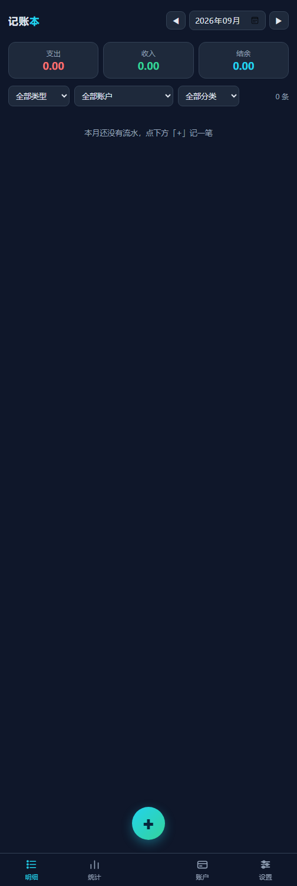

# 记账本 LedgerLink

**本地优先的个人记账工具**：三卡收支/预算 + 手机 App 自动入账（银行短信监听 + 支付画面读屏），数据全存本机，不上传任何服务器。



## 特点

- **三账户卡**：招行/建行（工资卡）+ 中行（主力），余额 = 期初 + 流水，分类预算进度条
- **手机自动入账**（核心）：
  - 通知监听：银行短信 / 微信支付 / 支付宝 → 提取金额、方向、商户 → 自动分类入账
  - 无障碍读屏：支付成功画面直接记一笔（**密码节点跳过，不碰支付凭证**）
  - 5 分钟同额去重；带「余额 X 元」的短信自动校准该卡余额
- **差额提醒 + 一键补记**：余额校准发现漏记 → 卡片红字提示 → 一键补记或忽略
- **手动记账**：底部 4 Tab（明细/统计/账户/设置）+ 中央「+」记一笔，日期分组、日汇总、编辑删除
- **备份/恢复**：TSV 数据文件，随时导出

## 下载

- **APK 直装**：[`ledger/mobile/app.apk`](./mobile/app.apk)（Android，安装后在系统设置开「通知使用权」+「无障碍」两个开关）
- **PC 网页版**：`pythonw app.py` → http://127.0.0.1:5100 （桌面有「记账本.lnk」快捷方式）

## 技术

| 部分 | 实现 |
|---|---|
| PC 服务 | Python **纯标准库**（无第三方依赖），端口 5100 |
| 手机端 | 纯 Java，**免 Gradle 构建链**（aapt2/javac/d8/zipalign/apksigner，见 `mobile/build.ps1`） |
| 手机数据 | 本地 TSV（accounts/tx/budgets），`stateJson()` 输出合法 JSON |
| 解析器 | 纯 Java `Parser.java`，与 PC 端 `parse_payment` 双端一致 |

## 测试

```powershell
# 每套测试前删 data/ 目录并重启 server（断言基于空库）
python tests\core_test.py     # 记账核心：三卡/预算/转账
python tests\notify_test.py   # 自动入账：短信解析/去重/分类
```

手机端 JVM 单测：`mobile\test\...\LedgerTest.java`（javac 编译后直接 java 跑，不带 android.jar）。

## 数据与隐私

- 数据在 `ledger/data/*.tsv|json`，已 gitignore，**绝不入库**
- 不读密码、不碰支付凭证；只在支付成功画面/银行短信上记账
- 无云同步、无账号、无遥测
